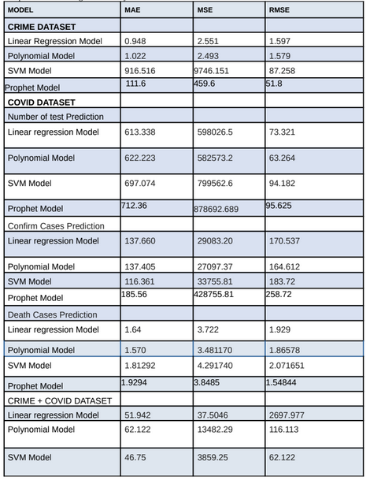
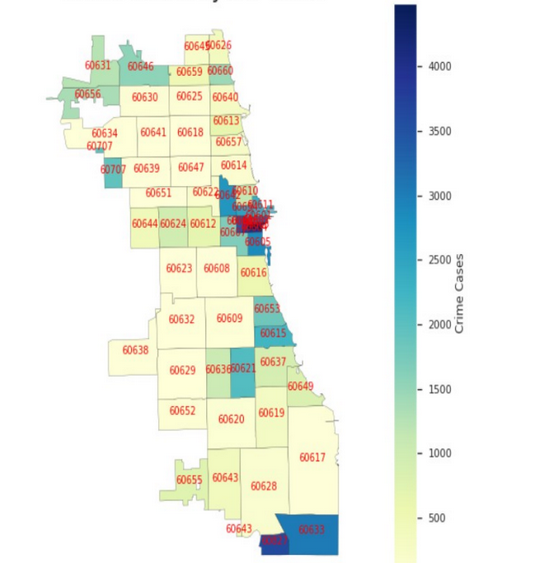

## <h2 align="center"> 
Hot Spot Detection in Chicago based on Covid-19 and Criminal Data
 </h2>

<h2 align= "center">Summary</h2>
 
> 
Crime rates are increasing exponential day by day due to covid-19 pendemic and proverty. We are trying to predicate region where Crime rate is maximum in Chicago City and this method used to predicate crime rate in any region in the world based on covid-19 data and previous crime data. So that we alert the people about those region where crime rate is maximum. To generate visualizations, we are using pandas library along with a simple clustering algorithm for the heatmap visualizations. We have sorted the tuples into relevant groups and then we use group labels to sort the matrix. NumPy was used to compute the matrices. 

> 
 We have performed temporal analysis of the crimes in Chicago based on the location description and date of the action. To compute the heatmaps rescaling has been done on the count of the crime w.r.t the type of crime on the Z scale. Negative values demonstrate low frequency of crime in a specific hour while the range of positive values demonstrates the high frequency. We have generated heat maps for crime in a certain hour, we have also generated a heat map for the most likely location of crime. Finally, demonstrate the geo-spatial representation of the crime hotspot based on its distinct nature.

> 
 This project is implemented in three major phases: Preprocessing of Dataset, Analysis to find a correlation between data and finally a heatmap is displayed based on various parameters. While pre-processing the dataset null attributes as well as the duplicate values were removed. Once, data was shaped data correlation was performed. Various features were used against each other to display a pictorial representation of the various essential statistics and finally heatmaps were displayed to depict the important information. Standard forecasting method like: Linear Regression , support vector machine , exponential smoothening (ES) will be used to forecast the threatening hotspots.

<h2 align= "center">Introduction</h2>
 
> 
In the recent years, Chicago has emerged as a hotspot of Crime. No matter how petty or Serious the nature of the crime, Chicago is turning out to be the epicenter. Several articles have been published which visualize the extent of the crimes through graphical representation. It has implemented the “Spatial Visualization Approach for Detecting Hotspot”. In this report, several visualizations have been performed based on the Crime dataset provided by the state government of Illinois. Similarly In our project we have analyzed the data related to criminal activities taking place in the locations of a city. Also, we will work on covid related data in the location of the city. After analyzing both the data we will try to conclude on what location are hotspot in the city where criminal activities can result in worse situations.

> 
 This project is implemented in three major phases: Preprocessing of Dataset, Analysis to find a correlation between data and finally a heatmap is displayed based on various parameters. While pre-processing the dataset null attributes as well as the duplicate values were removed. Once, data was shaped data correlation was performed. Various features were used against each other to display a pictorial representation of the various essential statistics and finally heatmaps were displayed to depict the important information. Standard forecasting method like: Linear Regression , support vector machine , exponential smoothening (ES) will be used to forecast the threatening hotspots. 

<h2 align= "center">Problem Statement </h2>

> 
Crime rates are increasing exponential day by day due to covid-19 pendemic and proverty . We are trying to predicate region where Crime rate is maximum in Chicago City and this method used to predicate crime rate in any region in the world based on covid-19 data and previous crime data . So that we alert the people about those region where crime rate is maximum. 

<h2 align= "center">Solution Approach</h2>
 
> 
 To generate visualizations, we are using pandas library along with a simple clustering algorithm for the heatmap visualizations. We have sorted the tuples into relevant groups and then we use group labels to sort the matrix. NumPy was used to compute the matrices. We have performed temporal analysis of the crimes in Chicago based on the location description and date of the action. To compute the heatmaps rescaling has been done on the count of the crime w.r.t the type of crime on the Z scale. Negative values demonstrate low frequency of crime in a specific hour while the range of positive values demonstrates the high frequency. We have generated heat maps for crime in a certain hour, we have also generated a heat map for the most likely location of crime Finally, demonstrate the geo-spatial representation of the crime hotspot based on its distinct nature.

<h2 align= "center"> Flow Diagram of purposed solution:</h2>

> _Diagrammatic Approch for the workflow of proposed methodology._

> 
 To generate visualizations, we are using pandas library along with a simple clustering algorithm for the heatmap visualizations. We have sorted the tuples into relevant groups and then we use group labels to sort the matrix. NumPy was used to compute the matrices. We have performed temporal analysis of the crimes in Chicago based on the location description and date of the action. To compute the heatmaps rescaling has been done on the count of the crime w.r.t the type of crime on the Z scale. Negative values demonstrate low frequency of crime in a specific hour while the range of positive values demonstrates the high frequency. We have generated heat maps for crime in a certain hour, we have also generated a heat map for the most likely location of crime. Finally, demonstrate the geo-spatial representation of the crime hotspot based on its distinct nature. This project is implemented in three major phases: Preprocessing of Dataset, Analysis to find a correlation between data and finally a heatmap is displayed based on various parameters. While pre-processing the dataset null attributes as well as the duplicate values were removed. Once, data was shaped data correlation was performed. Various features were used against each other to display a pictorial representation of the various essential statistics and finally heatmaps were displayed to depict the important information Standard forecasting method like: Linear Regression , support vector machine , exponential smoothening (ES) will be used to forecast the threatening hotspots

<h2 align= "center">Result</h2>

> 
 The predictive models error rate briefly elaborates the predictive models accuracy on the given dataset of the Covid Data and Criminal Data of Chicago collected over a span of time. The MSE, MAE and RMSE are mainly used metrics to evaluate the prediction error rates and model performance in regression analysis.

> 
 MAE (Mean absolute error) represents the difference between the original and predicted values extracted by averaged the absolute difference over the data set. MSE (Mean Squared Error) represents the difference between the original and predicted values extracted by squared the average difference over the data set.RMSE (Root Mean Squared Error) is the error rate by the square root of MSE.

> _showing density of criminal cases using Colors and locating zip code on map of Chicago. Dark color shows the high frequency of the cases in the particular region of zipcode._

<h2 align= "center">Conclusion</h2>

> 
 The right model can be chosen for the dataset by comparing the MAE, MSE and RMSE values from the Error table as it will justify the accuracy of the model. The correlation matrix depicts the correlation of the criminal cases and the covid cases. The higher correlation is between Criminal cases and Number of covid cases deaths. Also there is high.correlation between crime cases and population of the location. 

<h2 align= "center">Future Work</h2>

> 
 We can apply this on other cities of different countries. It can be also applied on the entire data set of the world if relevant data is available. But there is dependency on the availablity of crime data, as some countries show wrong data on their portal which can lead to wrong results and conclusions. 

---

 <h2 align="center"> ** Thank YOU ** </h2> 
 
 ***
